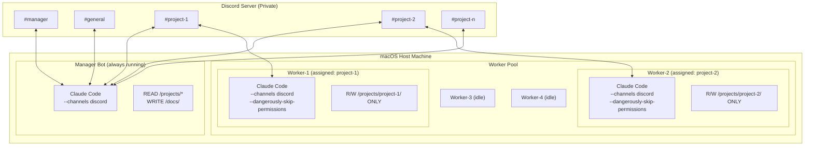
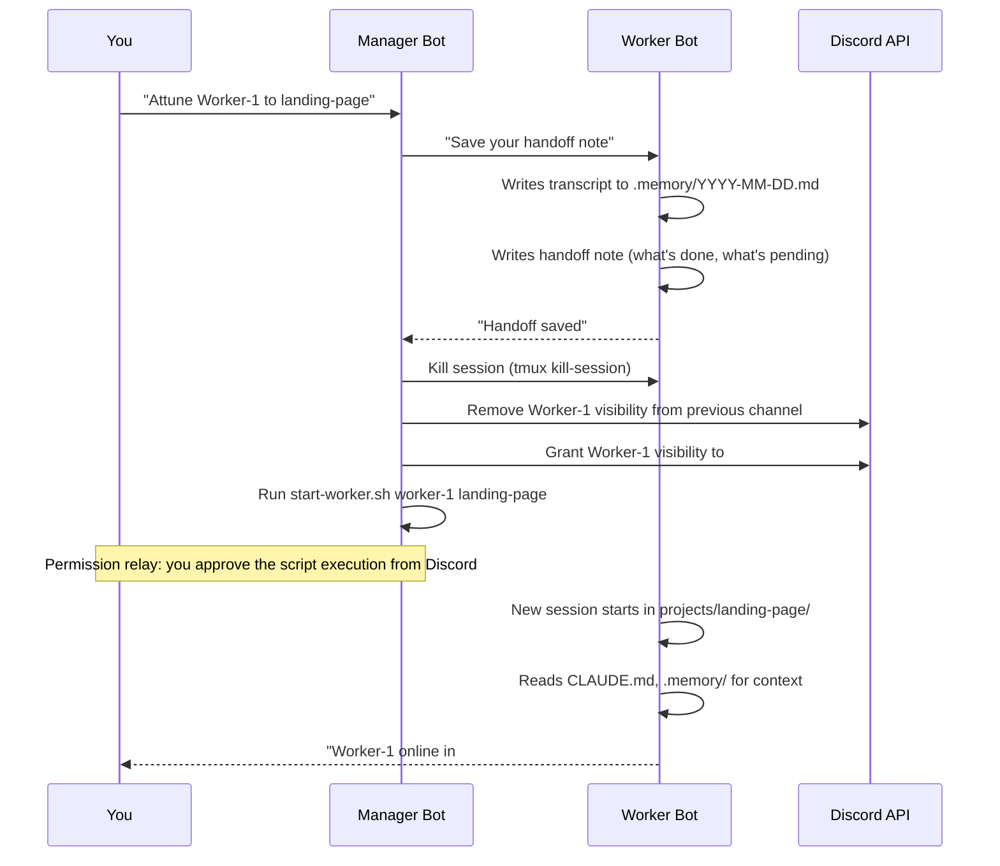

# Cantrip Architecture

## Overview

Cantrip is a multi-agent orchestration system that runs a pool of Claude Code worker instances (familiars) — coordinated by a manager bot — through a private Discord server using Claude Code's Channels feature. Each familiar is temporarily attuned to a project, operates within that project's folder, and communicates via the project's dedicated Discord channel.

**Success criterion**: From Discord alone, you can create a project, build a web app, and deploy it to Vercel — without touching a terminal.

## System Topology



## Core Concepts

### Worker Pool Model

Instead of one dedicated bot per project, Cantrip uses a pool of 4 pre-registered generic worker bots — familiars — (Bot-Worker-1 through Bot-Worker-4) that are attuned to projects on demand:

- At any time, a familiar is either **idle** or **attuned to exactly one project**
- The manager bot tracks attunements and suggests re-attunement when it sees unattended tasks in project channels
- You confirm all attunements — the manager never auto-attunes
- A project can only have one familiar at a time
- With 4 familiars and 10 projects, you can work on 4 projects simultaneously; the others queue

**Why a pool instead of one-per-project**: Fewer Discord bots to register, more efficient use of API sessions, and easier to scale. Casting a new project doesn't require creating a new Discord bot — just a new channel and project folder.

### Attunement Flow

When a familiar is attuned to a project:



### Channel Isolation

Worker bots are isolated to their attuned project's Discord channel using **Discord channel permissions** (hard gate) plus **CLAUDE.md instructions** (soft gate):

1. **Discord permissions**: When the manager attunes Worker-1 to `#landing-page`, it uses the Discord API to grant Worker-1's role "View Channel" on `#landing-page` and revoke it from any previous channel. The worker physically cannot see messages from other channels.
2. **CLAUDE.md**: The project's context file reinforces which channel the worker should respond in.

### Message Conventions

To prevent message loops (since the manager and worker bots may be in the same channel):

| Prefix | Used By | Meaning |
|--------|---------|---------|
| `[TASK]` | Manager | Delegation: "Here's what needs to be done" |
| `[DONE]` | Worker | Task completion report |
| `[STATUS]` | Manager | Status update or request |
| `[HANDOFF]` | Worker | Saving context before reassignment |
| `[MERGE]` | You | Confirmation to merge and/or deploy |

Each bot's CLAUDE.md instructs it to ignore messages prefixed with the other bot's prefixes, unless the message explicitly @-mentions it.

## Bot-to-Bot Communication

### Prototype Finding: Direct Bot-to-Bot Not Supported

**The official Discord Channels plugin filters out ALL non-human messages.** This was verified during prototyping:

- Bot messages (from other Claude Code instances): **filtered out, never delivered**
- Webhook messages: **filtered out, never delivered**
- Human user messages: **delivered normally**

The plugin only processes messages from paired human Discord users, regardless of what's in the `allowFrom` list in `access.json`. Adding bot user IDs to the allowlist has no effect.

### Working Delegation Model: Human-in-the-Loop

Since bot-to-bot messaging doesn't work, delegation follows a human relay pattern:

1. You tell the manager in `#manager` what you need
2. Manager drafts a task plan and may post it in the project channel (for your reference)
3. **You** post the task directly in `#project-<name>` — this is the trigger the worker receives
4. Worker executes the task and reports back

This keeps you in the loop for every delegation, which provides natural oversight.

### Future: Custom Channel Server

To enable fully autonomous bot-to-bot delegation, build a custom MCP channel server (~150-200 lines of TypeScript) that connects to Discord directly via `discord.js` without the official plugin's message filtering. This would be loaded with:

```bash
claude --dangerously-load-development-channels server:cantrip-discord
```

This is the planned upgrade path once the human-relay workflow is validated.

## End-to-End Workflow: Project → Build → Deploy

This is the primary success scenario — creating a project, building a web app, and deploying to Vercel entirely from Discord:

```
You in #manager                         System
───────────────                         ──────

"Create a new project called
 landing-page, Next.js,
 deploy to Vercel"
                                        Manager:
                                        1. mkdir projects/landing-page
                                        2. Writes CLAUDE.md from template
                                        3. Creates .memory/ directory
                                        4. gh repo create landing-page --private
                                        5. Tells you: "Project created. Start
                                           worker-1 on it?"
                                        (you approve via permission relay)
                                        6. Starts worker session

You in #landing-page:                   (Worker-1 is now running in this channel)
"Build a landing page with hero
 section, pricing table, and
 contact form"
                                        Worker-1:
                                        1. npx create-next-app .
                                        2. Builds components
                                        3. git add . && git commit
                                        4. git push -u origin feature/initial-build
                                        5. gh pr create --title "Initial build"
                                        6. Posts: "[DONE] PR ready:
                                           github.com/.../pull/1
                                           Reply [MERGE] to merge and deploy."

You: "[MERGE]"
                                        Worker-1:
                                        1. gh pr merge 1
                                        2. git checkout main && git pull
                                        3. vercel --prod --token $VERCEL_TOKEN
                                        4. Posts: "[DONE] Deployed:
                                           https://landing-page.vercel.app"
```

**Note**: You post tasks directly in the project channel because the Channels plugin only delivers human messages. The manager bot helps with planning, project setup, and coordination in `#manager`, but you are the trigger for worker tasks.

### Prerequisites for This Workflow

| Requirement | How |
|-------------|-----|
| `gh` CLI authenticated | `gh auth login` on the Mac (one-time) |
| `vercel` CLI installed | `npm i -g vercel` (one-time) |
| Vercel token | Set `VERCEL_TOKEN` env var globally |
| Git credentials | Shared SSH keys via `~/.ssh/` (upgrade to deploy keys later) |
| Node.js | Installed on the Mac for project scaffolding |

## Git Workflow

### Credentials

All bots share the Mac's global git config and SSH keys. The manager bot can create repos via `gh repo create` but does not work inside repos. Workers push to feature branches and create PRs.

**Future hardening**: Per-project GitHub deploy keys when onboarding partners.

### Merge and Deploy Protocol

Workers follow this convention (enforced via CLAUDE.md):

1. Always work on a feature branch (never push directly to main)
2. Create a PR when work is ready
3. Post the PR link in the project's Discord channel
4. **Wait for explicit `[MERGE]` confirmation** before merging
5. After merge, deploy if the project has a deploy target configured
6. Report the deployment URL

Workers have `--dangerously-skip-permissions` so they *could* merge without asking, but their CLAUDE.md strictly prohibits merging without user confirmation. This is convention-based safety.

### Deploy Targets

Deployment is configured per-project in the project's CLAUDE.md:

```markdown
**Deploy target**: Vercel
**Deploy command**: vercel --prod --token $VERCEL_TOKEN
**Production URL**: https://landing-page.vercel.app
```

Not all projects need a deploy target. The worker only runs the deploy command if one is configured and the user confirms.

## Memory System

### Architecture

Each bot maintains daily transcript files for persistent memory across sessions:

```
cantrip/
├── docs/
│   └── memory/
│       └── manager/
│           ├── 2026-03-28.md
│           ├── 2026-03-29.md
│           └── ...
└── projects/
    └── landing-page/
        └── .memory/
            ├── 2026-03-28.md
            ├── 2026-03-29.md
            └── ...
```

- **Project bot memory**: Lives in `projects/<name>/.memory/` (within the project folder, so the assigned worker can write to it)
- **Manager memory**: Lives in `docs/memory/manager/` (manager writes to docs/)
- The manager can read all project memory files (it has read access to all of `/projects/`)

### Memory Convention

After each interaction (message received + response sent), bots append to their daily file:

```markdown
## HH:MM — [brief description]

### Input
[Full message received from Discord]

### Actions
[What the bot did: commands run, files changed, commits made]

### Output
[Full response sent to Discord]

### Files Changed
- path/to/file.ts (created/modified/deleted)
```

### Handoff Notes

When a worker is being reassigned, it writes a special handoff section at the end of its daily file:

```markdown
## HH:MM — HANDOFF

### Current State
[What was in progress, what's done, what's pending]

### Uncommitted Changes
[List of files with uncommitted modifications]

### Recommendations for Next Worker
[Context the next worker should know]
```

### Retrieving Old Context

When a bot needs context from a previous session (e.g., "remember that conversation from 2 weeks ago"), it:

1. Lists the `.memory/` directory to find relevant date files
2. Reads only the specific day(s) needed — does NOT load all history
3. Scans headers (`## HH:MM — description`) to find the relevant section
4. Reads just that section into context

This keeps memory retrieval efficient — loading one day's file instead of weeks of history.

## Security Model

### Trust Architecture

```
┌─────────────────────────────────┐
│         You (Discord)           │  ← Only trusted human
├─────────────────────────────────┤
│       Manager Bot               │  ← Reads everything, writes docs/
│   (standard permissions)        │     Can execute launcher scripts
│                                 │     (with your Discord approval)
├─────────────────────────────────┤
│       Worker Bots (pool of 4)   │  ← Full access within assigned
│   (--dangerously-skip-perms)    │     project folder ONLY
│                                 │     Must wait for [MERGE] before
│                                 │     merging/deploying
└─────────────────────────────────┘
```

### Layers of Protection

| Layer | Mechanism | Enforcement |
|-------|-----------|-------------|
| Server access | Private Discord, invite-only | Discord |
| Sender gating | Channels allowlist per bot | Claude Code |
| Channel isolation | Discord role permissions | Discord API |
| File isolation | Worker launched in project folder | OS (working directory) |
| Manager read-only | CLAUDE.md + no skip-permissions | Convention + Claude |
| Merge gate | Worker waits for [MERGE] | Convention (CLAUDE.md) |
| Script approval | Permission relay for shell commands | Claude Code Channels |

### Hardening Options (Future)

For tighter security when onboarding partners:

1. **OS-level isolation**: Separate macOS/Linux user per worker slot
2. **Per-project deploy keys**: Scoped GitHub SSH keys per project
3. **Container isolation**: Run workers in Docker with volume mounts
4. **Network restrictions**: Firewall rules per worker

## Session Management

### macOS Persistence

Each bot runs in a tmux session. To survive sleep and reboots:

- **caffeinate**: Prevents the Mac from sleeping while bots are running
- **launchd**: Plist files auto-start tmux sessions on login
- The manager bot's launchd plist starts first, then launches workers as needed

### Session Lifecycle

```
Boot / Login
    → launchd starts manager bot (tmux session)
    → Manager reads bots.json, checks which workers should be running
    → Manager starts persistent workers
    → Workers reconnect to Discord via saved bot tokens
    → System is online
```

### API Usage

Claude Code sessions with Channels are **event-driven**: an idle bot waiting for a Discord message uses zero API tokens. Tokens are only consumed when processing a message. On the Max plan, running 4 workers + 1 manager with moderate usage is well within limits.

If rate limiting occurs during peak burst (e.g., 5 bots all processing simultaneously), persistent/assigned workers take priority. The manager can queue new tasks until a worker slot opens up.

## Configuration

### settings.json (static config)

All tokens, IDs, and keys live in one file: `/config/settings.json`. Fill it out once. All scripts read from it via a shared `lib.sh` library.

```
config/settings.json
├── discord.server_id              # Your Discord server
├── discord.manager_channel_id     # The #manager channel
├── discord.projects_category_id   # Category for project channels
├── user.discord_user_id           # Your Discord user ID
├── user.github_username           # For repo creation
├── tokens.manager                 # Bot tokens (one per Discord app)
├── tokens.worker-1..4
├── tokens.vercel                  # Vercel deploy token
├── tokens.github                  # GitHub token (if not using SSH)
└── bots.manager/worker-*.discord_user_id  # Bot user IDs
```

### bots.json (runtime state)

Tracks familiar attunements and the project registry. Updated by scripts at runtime — not manually edited.

### Adding a New Project

Run the `create-project.sh` script — it handles folder, CLAUDE.md, GitHub repo, Discord channel, bots.json, and access.json in one command:

```bash
./config/scripts/create-project.sh my-app --tech-stack "Next.js" --deploy-target "Vercel"
```

No new Discord bot registration needed — familiars are reusable.

## Prototype Findings

Verified during initial setup (March 2026):

- [x] **Allowlist config format**: JSON file at `~/.claude/channels/discord/access.json`. Contains `dmPolicy`, `allowFrom` (user IDs), and `groups` (channel-specific allowlists with `requireMention` and `allowFrom`).
- [x] **Bot token storage**: `~/.claude/channels/discord/.env` with `DISCORD_BOT_TOKEN=<token>`.
- [x] **Env var override**: Yes — `DISCORD_BOT_TOKEN` env var overrides the `.env` file. This allows multiple bots on the same Mac using different env vars per tmux session.
- [x] **Multiple simultaneous sessions**: Yes — manager + worker run in parallel on the same Mac, each with a different bot token via env var. Each responds under its own Discord bot identity.
- [x] **Shared access.json**: All bots share one `access.json` file. Pairing one bot registers the human user for all bots. New channels must be explicitly added to the `groups` section.
- [x] **Bot message filtering**: The Channels plugin **filters out ALL non-human messages** — bot messages and webhook messages are silently dropped. Only paired human users' messages are delivered to the Claude Code session. Adding bot user IDs to `allowFrom` has no effect.
- [x] **Channel isolation**: `--append-system-prompt` works to restrict bots to their assigned channels. CLAUDE.md alone is insufficient — bots don't reliably read it before responding to Channels messages. System prompt injection at launch time is required.
- [x] **Bun requirement**: The Discord plugin requires Bun. If Bun is installed via Homebrew, it may not be in PATH for subprocesses. Verify with `which bun`.
- [x] **Full dev cycle from Discord**: Worker successfully initialized git, built a Next.js app, pushed to GitHub, created a PR on a feature branch, merged on `[MERGE]` command, and deployed to Vercel — all triggered from Discord messages.
- [ ] Can the manager bot modify Discord channel permissions via API?
- [ ] What happens when a worker's session is killed while Channels is connected?

## Remaining Open Questions

- **Custom channel server**: Building a custom MCP channel server that doesn't filter bot messages would enable fully autonomous bot-to-bot delegation. This is the main upgrade path.
- **CLAUDE.md auto-loading**: Need to verify whether CLAUDE.md is loaded before or after the first Channels message arrives. If before, the issue may be context priority (system prompt > CLAUDE.md).
- **Permission relay from Discord**: Untested — does the permission relay actually work for approving shell commands from Discord?
- **Session cleanup**: What happens to the Discord connection when a tmux session is killed? Does the bot go offline immediately?
